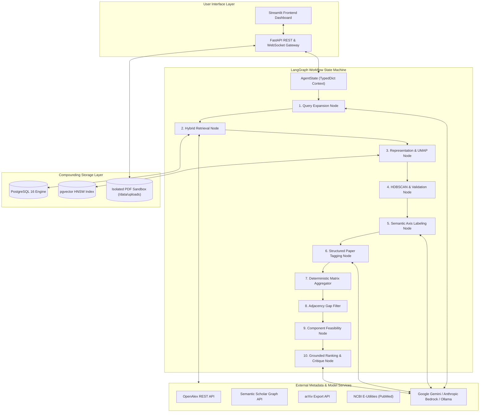

# Document 02: System Architecture & LangGraph State Machine

## 1. High-Level Architectural Overview

The system is decoupled into six modular, independently testable subsystems, orchestrated via **LangGraph** for clean state management, checkpointing, and deterministic branching between algorithmic nodes and LLM reasoning steps.



---

## 2. LangGraph State Machine Specification

LangGraph enforces a strictly typed, immutable state transitions throughout the execution pipeline.

### 2.1 State Definition (`AgentState`)

```python
from typing import TypedDict, List, Dict, Any, Optional
from pydantic import BaseModel, Field

class PaperMetadata(BaseModel):
    id: str  # UUID
    doi: Optional[str] = None
    title: str
    abstract: str
    authors: List[str] = []
    year: int
    citation_count: int = 0
    source: str  # 'openalex', 's2', 'arxiv', 'pubmed', 'uploaded_pdf'
    source_url: str
    is_uploaded: bool = False
    full_text_available: bool = False
    sections: Dict[str, str] = {}  # 'abstract', 'methods', 'limitations', 'future_work'
    embedding: Optional[List[float]] = None
    cluster_id: Optional[int] = None
    axis_a_tag: Optional[str] = None
    axis_b_tag: Optional[str] = None
    tag_confidence: Optional[str] = None  # 'high', 'medium', 'low'

class DiscoveredDimension(BaseModel):
    cluster_id: int
    label: str
    short_description: str
    key_terms: List[str]
    paper_count: int
    cohesion_score: float

class MatrixCell(BaseModel):
    cell_id: str
    axis_a_val: str
    axis_b_val: str
    paper_ids: List[str]
    paper_count: int
    sparsity_score: float
    is_candidate_gap: bool
    adjacent_populated_count: int

class RankedGapDossier(BaseModel):
    gap_id: str
    axis_a_val: str
    axis_b_val: str
    novelty_score: float  # 1.0 - 5.0
    feasibility_score: float  # 1.0 - 5.0
    impact_score: float  # 1.0 - 5.0
    composite_opportunity_score: float
    feasibility_rationale: str
    counter_argument: str  # Devil's Advocate failure reason
    supporting_evidence: List[Dict[str, Any]]  # Neighboring papers with citations and roles
    extracted_future_work_seeds: List[str]
    grounding_conditions: List[str]  # Decision tree conditions met

class AgentState(TypedDict):
    topic_query: str
    expanded_queries: List[str]
    user_uploaded_pdf_paths: List[str]
    corpus_papers: List[PaperMetadata]
    silhouette_score: float
    discovered_dimensions: List[DiscoveredDimension]
    predefined_dimension_values: List[str]
    matrix_cells: List[MatrixCell]
    candidate_gaps: List[MatrixCell]
    ranked_gaps: List[RankedGapDossier]
    execution_logs: List[str]
    error_state: Optional[str]
```

### 2.2 LangGraph Execution Nodes

| Node Name | Nature | Responsibility | Fallback Mechanism |
|---|---|---|---|
| `expand_queries` | LLM | Expands user topic into 3-5 distinct query variants | Identity query if LLM fails |
| `hybrid_retrieve` | Deterministic + Cache | Checks PostgreSQL for existing DOIs/titles, queries APIs for missing, parses uploaded PDFs | Return cached papers if API fails |
| `embed_corpus` | Deterministic (ML) | Generates 384-dim embeddings via Sentence Transformers, updates `pgvector` | Batch processing (chunks of 32) |
| `cluster_and_validate` | Deterministic (ML) | UMAP reduction + HDBSCAN clustering; calculates Silhouette Score | If Silhouette $< 0.15$ or clusters $< 2$, fallback to KMeans ($k=4$) |
| `label_clusters` | LLM | Generates human-readable labels from top centroid papers | Top TF-IDF n-grams fallback |
| `classify_papers` | LLM Structured Output | Tags each paper into Axis A $\times$ Axis B with confidence scores | Few-shot prompt; default to "Other/Emerging" on low confidence |
| `aggregate_matrix` | Deterministic (Python) | Constructs 2D matrix, computes cell counts and sparsity | Strictly zero LLM involvement |
| `filter_candidate_gaps`| Deterministic (Python) | Retains only sparse cells with $\ge 1$ populated orthogonal neighbor | Strictly zero LLM involvement |
| `estimate_feasibility` | Deterministic + LLM | Aggregates component resource profiles and extrapolates baseline score | Conservative 2.5 baseline score |
| `rank_and_critique` | LLM Structured Output | Evaluates novelty, computes composite score, and generates Devil's Advocate critique | Grounded strictly in neighbor context |

---

## 3. Database Schema (PostgreSQL 16 + `pgvector`)

All relations are defined using SQLAlchemy 2.0 with strict types and parameterized queries.

```sql
-- Enable pgvector extension
CREATE EXTENSION IF NOT EXISTS vector;
CREATE EXTENSION IF NOT EXISTS "uuid-ossp";

-- Papers table (The Compounding Knowledge Base)
CREATE TABLE IF NOT EXISTS papers (
    id UUID PRIMARY KEY DEFAULT uuid_generate_v4(),
    doi VARCHAR(255) UNIQUE,
    normalized_title VARCHAR(512) NOT NULL,
    original_title TEXT NOT NULL,
    abstract TEXT NOT NULL,
    full_text TEXT,
    authors JSONB DEFAULT '[]'::jsonb,
    publication_year INTEGER NOT NULL,
    citation_count INTEGER DEFAULT 0,
    source VARCHAR(64) NOT NULL, -- 'openalex', 's2', 'arxiv', 'pubmed', 'upload'
    source_url TEXT NOT NULL,
    is_uploaded BOOLEAN DEFAULT FALSE,
    pdf_local_path TEXT,
    created_at TIMESTAMP WITH TIME ZONE DEFAULT CURRENT_TIMESTAMP
);

CREATE INDEX IF NOT EXISTS idx_papers_doi ON papers(doi);
CREATE INDEX IF NOT EXISTS idx_papers_norm_title ON papers(normalized_title);
CREATE INDEX IF NOT EXISTS idx_papers_year ON papers(publication_year);

-- Embeddings table (Vector storage)
CREATE TABLE IF NOT EXISTS paper_embeddings (
    paper_id UUID PRIMARY KEY REFERENCES papers(id) ON DELETE CASCADE,
    embedding vector(384) NOT NULL, -- all-MiniLM-L6-v2 vector dimension
    model_name VARCHAR(128) NOT NULL,
    created_at TIMESTAMP WITH TIME ZONE DEFAULT CURRENT_TIMESTAMP
);

-- HNSW vector index for high-speed cosine similarity
CREATE INDEX IF NOT EXISTS idx_embeddings_hnsw 
ON paper_embeddings USING hnsw (embedding vector_cosine_ops)
WITH (m = 16, ef_construction = 64);

-- Paper Sections table (Extracted sections for open access / uploads)
CREATE TABLE IF NOT EXISTS paper_sections (
    id UUID PRIMARY KEY DEFAULT uuid_generate_v4(),
    paper_id UUID NOT NULL REFERENCES papers(id) ON DELETE CASCADE,
    section_type VARCHAR(64) NOT NULL, -- 'abstract', 'methods', 'limitations', 'future_work'
    content TEXT NOT NULL,
    created_at TIMESTAMP WITH TIME ZONE DEFAULT CURRENT_TIMESTAMP
);

CREATE INDEX IF NOT EXISTS idx_sections_paper ON paper_sections(paper_id);
CREATE INDEX IF NOT EXISTS idx_sections_type ON paper_sections(section_type);

-- Research Queries & Matrix Runs
CREATE TABLE IF NOT EXISTS analysis_runs (
    id UUID PRIMARY KEY DEFAULT uuid_generate_v4(),
    query_text TEXT NOT NULL,
    expanded_queries JSONB NOT NULL,
    corpus_size INTEGER NOT NULL,
    silhouette_score NUMERIC(5, 4),
    axis_a_name VARCHAR(128) NOT NULL,
    axis_b_name VARCHAR(128) NOT NULL,
    axis_a_labels JSONB NOT NULL,
    axis_b_labels JSONB NOT NULL,
    created_at TIMESTAMP WITH TIME ZONE DEFAULT CURRENT_TIMESTAMP
);

-- Gap Results Table
CREATE TABLE IF NOT EXISTS gap_results (
    id UUID PRIMARY KEY DEFAULT uuid_generate_v4(),
    run_id UUID NOT NULL REFERENCES analysis_runs(id) ON DELETE CASCADE,
    axis_a_val VARCHAR(128) NOT NULL,
    axis_b_val VARCHAR(128) NOT NULL,
    cell_paper_count INTEGER NOT NULL,
    novelty_score NUMERIC(3, 2) NOT NULL,
    feasibility_score NUMERIC(3, 2) NOT NULL,
    impact_score NUMERIC(3, 2) NOT NULL,
    composite_score NUMERIC(3, 2) NOT NULL,
    counter_argument TEXT NOT NULL,
    grounding_evidence JSONB NOT NULL,
    created_at TIMESTAMP WITH TIME ZONE DEFAULT CURRENT_TIMESTAMP
);
```

---

## 4. Security Architecture (Mandatory Web Security Skill Compliance)

1. **SQL Injection Prevention**:
   - Zero raw string formatting or SQL concatenation.
   - All interactions utilize SQLAlchemy ORM with typed bind parameters.
2. **Secure File Upload Pipeline**:
   - Upload directory located in non-executable workspace storage (`/data/uploads`).
   - Magic bytes verification: check first 5 bytes equal `%PDF-` before parsing.
   - Strict size limitation: reject files $> 15\text{ MB}$.
   - Unpredictable UUID file renaming to prevent directory traversal (`../`) attacks.
   - Parsing isolation with timeout limits (preventing PDF decompression bomb / DoS).
3. **Localhost Network Binding**:
   - For all local testing and services, servers explicitly bind to `127.0.0.1`, never `0.0.0.0`.
4. **Secret Management**:
   - No hardcoded API keys or fallback tokens in code.
   - All external keys (`OPENALEX_EMAIL`, `S2_API_KEY`, `GEMINI_API_KEY`, `POSTGRES_PASSWORD`) loaded exclusively via `.env` with validation.

