# Document 03: Tech Stack & Dual Deployment Architecture (Local vs. Cloud)

## 1. Architectural Philosophy: "Build Local, Architect for Cloud"

To ensure zero vendor lock-in and eliminate early cloud costs while maintaining enterprise scalability, the platform supports two deployment topologies:
1. **Local Open-Source Topology ("Build It")**: 100% runnable on local developer machines or self-hosted servers with Docker Compose. Zero cloud bill.
2. **Cloud Serverless Topology ("Ship It")**: Turnkey mapping to AWS production services (S3, RDS PostgreSQL with pgvector, Amazon Bedrock, App Runner/Lambda, Cognito).

```mermaid
flowchart LR
    subgraph LOCAL ["Topology A: Local Open-Source (Zero Bill)"]
        direction TB
        DockerComp["Docker Compose"]
        LocalPG["PostgreSQL 16 + pgvector Container"]
        LocalFastAPI["FastAPI Python Service"]
        LocalStreamlit["Streamlit Interactive UI"]
        LocalStack["LocalStack / Local File Sandbox"]
        LocalEmbed["Sentence Transformers (Local CPU/GPU)"]
    end

    subgraph CLOUD ["Topology B: Cloud Production (Scales to Zero)"]
        direction TB
        AppRunner["AWS App Runner / ECS Fargate"]
        RDS_PG["Amazon RDS for PostgreSQL + pgvector"]
        S3_Buckets["Amazon S3 (PDF Storage & Cache)"]
        Bedrock["Amazon Bedrock (Claude 3.5 Sonnet / Titan)"]
        CognitoAuth["Amazon Cognito (User Auth & RBAC)"]
        StepFunc["AWS Step Functions (Pipeline Orchestration)"]
    end

    LOCAL -.->|One-to-One Service Mapping| CLOUD
```



---

## 2. Detailed Tech Stack Comparison

| Functional Area | Local Open-Source Choice | Cloud Production Equivalent | Rationale & Portability |
|---|---|---|---|
| **Orchestration** | LangGraph (Python) | LangGraph + AWS Step Functions | LangGraph state definitions run identically in both environments. |
| **Relational & Vector DB** | PostgreSQL 16 + `pgvector` container | Amazon RDS for PostgreSQL (with `pgvector`) | Same SQL schemas, indexes, and SQLAlchemy queries execute without modification. |
| **Document Storage** | Local sandboxed volume (`/data/uploads`) | Amazon S3 with SSE-S3 encryption | Abstracted via a unified `FileStorageBackend` Python interface. |
| **Embedding Model** | `all-MiniLM-L6-v2` / `SciBERT` (SentenceTransformers) | Amazon Bedrock Titan Multimodal or Sagemaker | Local embeddings run fast on CPU with zero latency and zero API cost. |
| **LLM Inference** | Google Gemini 1.5 Flash/Pro OR Local Ollama (Llama 3 / Mistral) | Amazon Bedrock (Claude 3.5 Sonnet / Llama 3) | LangChain chat model abstraction allows switching providers via single config line. |
| **Backend API** | FastAPI (Python 3.11/3.12) | AWS App Runner / ECS Fargate / Lambda | Asynchronous, auto-generating OpenAPI docs, high throughput. |
| **Interactive UI** | Streamlit + Plotly + NetworkX | Streamlit on App Runner OR Next.js on Amplify | Streamlit provides rapid 4-day development with native reactive UI controls. |
| **Containerization** | Docker + Docker Compose 2.40+ | AWS ECR + ECS / App Runner | Reproducible builds with isolated multi-stage Dockerfiles. |

---

## 3. Local Docker Compose Blueprint (`docker-compose.yml`)

The local setup spins up the complete ecosystem with a single command:
`docker compose -f docker/docker-compose.yml up -d`

```yaml
version: '3.8'

services:
  postgres:
    image: pgvector/pgvector:pg16
    container_name: research_postgres
    restart: unless-stopped
    environment:
      POSTGRES_USER: ${POSTGRES_USER:-postgres}
      POSTGRES_PASSWORD: ${POSTGRES_PASSWORD:-postgres_secure_pass}
      POSTGRES_DB: ${POSTGRES_DB:-research_db}
    ports:
      - "127.0.0.1:5432:5432" # Strict localhost binding for security
    volumes:
      - pgdata:/var/lib/postgresql/data
      - ./docker/init_db.sql:/docker-entrypoint-initdb.d/init_db.sql:ro
    healthcheck:
      test: ["CMD-SHELL", "pg_isready -U ${POSTGRES_USER:-postgres} -d ${POSTGRES_DB:-research_db}"]
      interval: 5s
      timeout: 5s
      retries: 5

  backend:
    build:
      context: ..
      dockerfile: docker/Dockerfile.backend
    container_name: research_backend
    restart: unless-stopped
    environment:
      DATABASE_URL: postgresql+asyncpg://${POSTGRES_USER:-postgres}:${POSTGRES_PASSWORD:-postgres_secure_pass}@postgres:5432/${POSTGRES_DB:-research_db}
      GEMINI_API_KEY: ${GEMINI_API_KEY}
      OPENALEX_EMAIL: ${OPENALEX_EMAIL}
      S2_API_KEY: ${S2_API_KEY:-}
      UPLOAD_DIR: /data/uploads
    volumes:
      - ../data/uploads:/data/uploads
    ports:
      - "127.0.0.1:8000:8000"
    depends_on:
      postgres:
        condition: service_healthy

  frontend:
    build:
      context: ..
      dockerfile: docker/Dockerfile.frontend
    container_name: research_frontend
    restart: unless-stopped
    environment:
      BACKEND_API_URL: http://backend:8000
    ports:
      - "127.0.0.1:8501:8501"
    depends_on:
      - backend

volumes:
  pgdata:
```

---

## 4. Local Tooling Integration

### Strands Agents SDK & Local Models
For fully private offline operations, the LangGraph agent can route classification and ranking calls to a local **Ollama** endpoint running `llama3:8b` or `mistral-nemo`. The embedding pipeline runs natively using PyTorch and HuggingFace Sentence Transformers with CPU multithreading.

### SAM CLI + LocalStack
For teams testing AWS serverless pipelines locally:
- **LocalStack** mocks S3 and DynamoDB locally on port `4566`.
- **SAM CLI** enables running Lambda functions simulating background paper indexing without incurring any AWS charges.

---

## 5. Cloud Migration Blueprint (When Deploying to Production)

When transitioning to AWS:
1. **Data Layer**: Replace containerized Postgres with **Amazon RDS for PostgreSQL**, enabling the `pgvector` extension.
2. **File Storage**: Replace `/data/uploads` volume with an **Amazon S3** bucket featuring lifecycle policies (infrequent access transitions) and presigned upload URLs.
3. **Compute**:
   - Backend API deploys on **AWS App Runner** with auto-scaling (scales down during inactivity).
   - Long-running indexing jobs trigger via **Amazon EventBridge** into **AWS Step Functions**.
4. **LLMs**: Switch model provider to **Amazon Bedrock**, invoking `anthropic.claude-3-5-sonnet-20241022-v2:0` for ranking and `amazon.titan-embed-text-v2:0` for embeddings.
5. **Security & Identity**: Front with **Amazon Cognito** user pools and enforce authorization policies using **AWS Cedar** or IAM roles.

