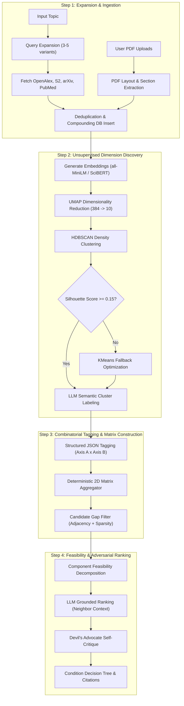

# Document 04: Pipeline & Methodology Specification

## 1. Pipeline Overview

The research discovery pipeline transforms raw, noisy scientific literature into a structured, evidence-backed matrix of vetted opportunities.



---

## 2. Mathematical Formulations

### 2.1 Embeddings & Dimensionality Reduction
Given a corpus of $N$ papers $\mathcal{P} = \{p_1, p_2, \dots, p_N\}$, each paper $p_i$ is mapped to a continuous vector:
$$\mathbf{v}_i = \text{SentenceTransformer}(\text{Title}_i \oplus \text{" [SEP] "} \oplus \text{Abstract}_i) \in \mathbb{R}^{384}$$

High-dimensional cosine geometry is preserved in low-dimensional space via **UMAP** (Uniform Manifold Approximation and Projection):
$$\mathbf{z}_i = \text{UMAP}(\mathbf{v}_i) \in \mathbb{R}^{10}, \quad \text{parameters: } k_{\text{neighbors}}=15, \delta_{\text{min}}=0.1, \text{metric}=\text{cosine}$$

### 2.2 Cluster Cohesion Gating & Outlier Handling
Clusters are identified using **HDBSCAN** ($\text{min\_cluster\_size} = 5, \text{min\_samples} = 3$).
To prevent noisy, overlapping clusters from polluting matrix dimensions, the clustering partition $\mathcal{C} = \{C_1, C_2, \dots, C_k\}$ is validated using the **Silhouette Score**:
$$s(i) = \frac{b(i) - a(i)}{\max(a(i), b(i))}, \quad \bar{S} = \frac{1}{N} \sum_{i=1}^N s(i)$$
where $a(i)$ is the mean intra-cluster distance of paper $i$, and $b(i)$ is the lowest mean distance to any other cluster.

- **Gate Rule**: If $\bar{S} < 0.15$ or $k < 2$, HDBSCAN is superseded by **KMeans** clustering where $k$ is optimized across $k \in [3, 8]$ by maximizing $\bar{S}$.
- **Outlier Reassignment**: Unassigned papers (label $-1$) are either assigned to the closest centroid if cosine distance $< 0.35$, or categorized under `"Other/Emerging"`.

### 2.3 Combinatorial Matrix & Adjacency Sparsity Formulation
Let Axis A have categories $\{a_1, \dots, a_m\}$ and Axis B have categories $\{b_1, \dots, b_n\}$.
The cell density at coordinates $(i, j)$ is:
$$C(i, j) = \sum_{k=1}^N \mathbb{I}(\text{AxisA}(p_k) = a_i \land \text{AxisB}(p_k) = b_j)$$

- **Adaptive Sparsity Threshold**:
  $$S_{\text{threshold}} = \max\left(1, \left\lfloor 0.02 \times N \right\rfloor\right)$$
- **Adjacency Criterion**: A cell $(i, j)$ is a **Candidate Gap** $\mathcal{G}$ if and only if:
  $$C(i, j) \le S_{\text{threshold}} \quad \text{AND} \quad \left( \exists k \neq j : C(i, k) \ge 3 \cdot S_{\text{threshold}} \lor \exists l \neq i : C(l, j) \ge 3 \cdot S_{\text{threshold}} \right)$$
- **Adjacency Weight**:
  $$W_{\text{adj}}(i, j) = \log_2\left(1 + \sum_{k \neq j} \mathbb{I}(C(i, k) \ge 3 S) + \sum_{l \neq i} \mathbb{I}(C(l, j) \ge 3 S)\right)$$
  *Isolated empty cells with zero populated neighbors receive weight 0 and are discarded as likely non-viable combinations.*

### 2.4 Component-Extrapolated General Feasibility
For an untried combination $(a_i, b_j)$, direct empirical data is absent. We extrapolate general feasibility $\mathcal{F}(a_i, b_j) \in [1.0, 5.0]$ by decomposing into component attributes:
$$\mathcal{F}(a_i, b_j) = w_m \cdot \mathcal{M}(a_i) + w_d \cdot \mathcal{D}(b_j) - w_c \cdot \Delta(a_i, b_j)$$
Where:
- $\mathcal{M}(a_i)$: Methodology maturity score derived from average publication age and citation depth of $a_i$ across all other applications.
- $\mathcal{D}(b_j)$: Domain data/benchmark readiness score derived from paper volume and standard dataset mentions in $b_j$.
- $\Delta(a_i, b_j)$: Integration penalty (e.g., mismatch between compute-intensive continuous models and discrete low-latency embedded constraints).
- $w_m = 0.4, w_d = 0.4, w_c = 0.2$.

---

## 3. PDF Layout & Section Extraction Specification

Academic PDFs (especially IEEE, ACM, Springer) feature complex two-column layouts. The parser executes a two-phase extraction pipeline:

```
[Raw PDF Bytes] 
       │
       ▼ Magic Bytes Check (%PDF-)
[PyMuPDF / pdfplumber]
       │
       ▼ Bounding Box & Column Sorting (x0, y0 sort)
[Clean Unified Text Stream]
       │
       ▼ Section Heading Regex Matcher
┌────────────────────────────────────────────────────────┐
│ - Abstract:   /^(\d\.\s*)?Abstract/i                   │
│ - Methods:    /^(\d\.\s*)?(Methodology|Methods|Model)/i │
│ - Limitations:/^(\d\.\s*)?(Limitations|Weaknesses)/i   │
│ - Future Work:/^(\d\.\s*)?(Future\s*(Work|Directions))/i│
└────────────────────────────────────────────────────────┘
       │
       ▼
[Extracted Structured Sections in PostgreSQL]
```

If full-text parsing fails or yields garbled unicode, the engine gracefully falls back to the retrieved API abstract, logging a warning without halting execution.

---

## 4. LLM Prompts & Structured JSON Output Schemas

### 4.1 Cluster Semantic Labeling Prompt
```json
{
  "system": "You are an expert academic taxonomy classifier. Analyze the provided representative papers from an unsupervised cluster and return a concise, standardized research axis label.",
  "input": "Papers in cluster:\n- Title: Diffusion Models for Video Generation\n- Title: Continuous Latent Video Diffusion\n- Title: Temporal Attention in Latent Spaces\n...",
  "output_schema": {
    "label": "Short label (2-4 words, e.g., 'Latent Video Diffusion')",
    "description": "One sentence summary of the technical paradigm",
    "key_methods": ["Diffusion", "Temporal Attention", "Latent Dynamics"]
  }
}
```

### 4.2 Ranking & Devil's Advocate Prompt
```json
{
  "system": "You are a skeptical, senior academic peer reviewer. Evaluate this proposed candidate research gap. Ground your response STRICTLY in the provided neighboring papers. Do NOT hallucinate.",
  "input": {
    "candidate_gap": {"axis_a": "Physics-Informed Neural Networks", "axis_b": "High-Frequency Algorithmic Trading"},
    "neighboring_papers_a": ["PINNs for Fluid Dynamics (2024)", "Solving PDEs with Deep Galerkin (2023)"],
    "neighboring_papers_b": ["Transformer Market Predictors (2024)", "LOB Orderbook Forecasting (2025)"],
    "component_feasibility_score": 2.2
  },
  "output_schema": {
    "novelty_score": 4.8,
    "feasibility_score": 2.0,
    "impact_score": 3.5,
    "composite_score": 3.4,
    "opportunity_rationale": "Grounded explanation of the potential synergy...",
    "counter_argument": "Strongest reason why this direction might fail: Differential equations in physics assume smooth, continuous conservation laws. Financial limit-order books exhibit discontinuous, adversarial microstructure noise, rendering PINN physical inductive biases fundamentally mismatched.",
    "grounding_citations": [
      {"doi": "10.1234/s2", "role": "Demonstrates PINN boundary condition limits"}
    ]
  }
}
```

