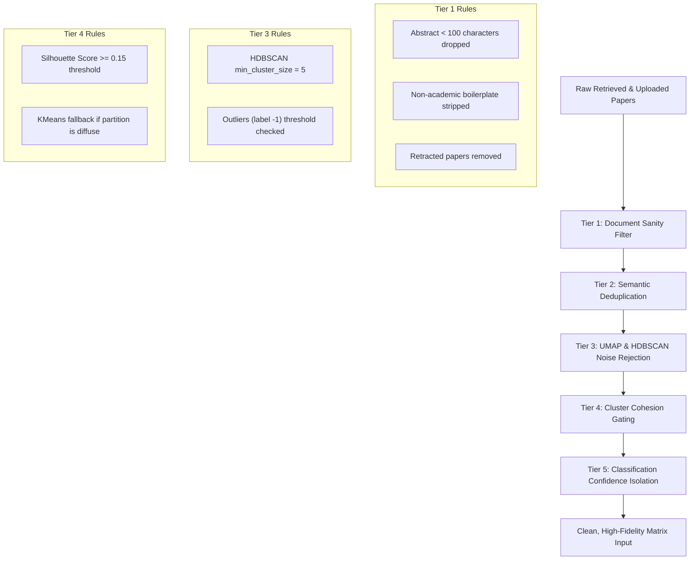

# Document 05: Evaluation, Noise Reduction & Benchmarks

## 1. Noise Reduction Framework

Academic literature retrieval is inherently contaminated by keyword collisions, off-topic preprints, ambiguous titles, and fragmented clusters. The platform enforces a multi-tier noise filtration protocol.

### 1.1 Multi-Tier Filtration Rules
1. **Tier 1: Document Sanity Filter**:
   - Discard records missing both abstract and full-text.
   - Filter out conference proceedings headers, editor notes, and errata.
2. **Tier 2: Semantic Deduplication**:
   - Exact DOI match $\implies$ immediate unification.
   - Title normalization: lowercasing, punctuation stripping, stopword removal, followed by Levenshtein distance check ($> 0.92 \implies$ duplicate).
3. **Tier 3: Density-Based Noise Rejection (HDBSCAN)**:
   - Any cluster with fewer than 5 papers is discarded or merged into its nearest neighbor.
   - Points flagged as noise (label $-1$) are evaluated: if cosine distance to the nearest centroid is $< 0.35$, the point is absorbed; otherwise, it is assigned to an explicit `"Other/Emerging"` category.
4. **Tier 4: Cohesion Gating**:
   - If overall Silhouette Score $< 0.15$, the embedding space lacks distinct density peaks. The system automatically switches to regularized KMeans ($k \in [3, 8]$) selecting the $k$ that maximizes the Silhouette Score.
5. **Tier 5: Classification Confidence Isolation**:
   - Papers tagged with `low` confidence during LLM dimensional classification are logged for debugging but **excluded from raw matrix density counts**, preventing false cell saturation.

---

## 2. Evaluation Metrics Suite

### 2.1 Intrinsic Clustering Metrics
These metrics measure the mathematical quality of discovered dimensions without requiring human annotations:

1. **Silhouette Score ($\bar{S}$)**:
   $$\bar{S} = \frac{1}{N}\sum_{i=1}^N \frac{b(i) - a(i)}{\max(a(i), b(i))}, \quad \text{Target: } \bar{S} \ge 0.20$$
2. **Davies-Bouldin Index ($DB$)**:
   $$DB = \frac{1}{k} \sum_{i=1}^k \max_{j \neq i} \left(\frac{\sigma_i + \sigma_j}{d(c_i, c_j)}\right), \quad \text{Target: } DB < 1.8$$
   Measures the average similarity ratio of each cluster with its most similar cluster. Lower is better.
3. **Topic Coherence (NPMI - Normalized Pointwise Mutual Information)**:
   $$\text{NPMI}(w_i, w_j) = \frac{\log \frac{P(w_i, w_j)}{P(w_i)P(w_j)}}{-\log P(w_i, w_j)}, \quad \text{Target: } \text{NPMI} \ge 0.12$$
   Calculated over the top 10 characteristic terms of each discovered cluster.
4. **Topic Diversity ($TD$)**:
   $$TD = \frac{\text{Unique Top Words across all clusters}}{K \times 10}, \quad \text{Target: } TD \ge 0.70$$
   Ensures clusters do not repeat synonymous concepts under different labels.

### 2.2 Extrinsic Benchmark (Survey Gap Ground Truth)
To test whether the matrix identifies genuinely recognized frontiers:
- **Benchmark Dataset**: 5 high-impact 2024 survey papers across distinct fields (e.g., *LLM Hallucination Mitigation, Physics-Informed Neural Networks, Quantum Error Correction, Embodied Robotics, Multimodal Biomedical Vision*).
- **Ground Truth Gaps**: 10 explicitly stated "Open Challenges / Future Directions" from each survey.
- **Metric**:
  - **Precision@K**: Percentage of top $K$ recommended gaps that map directly to an acknowledged survey challenge.
  - **Recall@K**: Percentage of the 10 acknowledged survey challenges surfaced within the top $K$ matrix candidate gaps ($K=5$).
  - Target: $\text{Precision@5} \ge 70\%$, $\text{Recall@5} \ge 60\%$.

### 2.3 Human Evaluation Protocol & Rubric
During evaluation, 3 domain experts score recommendations on a 1–5 Likert scale using this rubric:

| Score | Gap Relevance | Novelty | Feasibility Rationale | Devil's Advocate Soundness |
|---|---|---|---|---|
| **5 (Excellent)** | Perfectly aligned with current field problems | Truly untried combination; high publication potential | Clear, realistic resource profile & dataset path | Identified a genuine theoretical or empirical roadblock |
| **4 (Good)** | Meaningful intersection | Rare combination; slight variants exist | Minor unaddressed engineering challenge | Solid counter-argument, though solvable |
| **3 (Acceptable)**| Tangential intersection | Explored under different terminology | Generic compute/data estimation | Plausible but generic critique |
| **2 (Weak)** | Artificial combination | Saturated or well-explored | Unrealistic data or compute assumption | Weak or irrelevant counter-argument |
| **1 (Invalid)** | Nonsensical combination | Already widely studied | Completely unfeasible | Hallucinated or non-existent barrier |

**Hallucination Rate Target**: $\mathbf{0\%}$. Every cited supporting paper must exist in the retrieved corpus, and every quote must resolve to the verified document text.

---

## 3. Advanced Exploratory Gap Signals

### 3.1 Contradiction & Controversy Detection
- Computes pairwise cosine similarity between paper abstracts within the same matrix cell.
- If similarity $> 0.75$ but sentiment / outcome polarity is opposite (e.g., Paper A: *"demonstrates significant accuracy improvements without latency penalty"* vs. Paper B: *"incurs severe latency degradation with negligible accuracy gain"*), the cell is flagged with a **Controversy Indicator ($\Delta \text{Contradiction}$)**.
- Gaps in controversial cells represent high-value opportunities to reconcile competing findings.

### 3.2 Temporal Stagnation Gaps
- If a matrix cell possesses moderate density ($C(i, j) \ge 5$) but $100\%$ of its papers were published $> 4$ years ago, it is flagged as a **Temporal Stagnation Gap**.
- The system prompts the LLM: *"Why did this area stop publishing? Can modern architectures (e.g., Transformers, Diffusion) unblock this dormant direction?"*

### 3.3 Demographic & Benchmark Coverage Scan
- Scans abstracts for benchmark dataset names (e.g., ImageNet, MIMIC-III, GLUE, HumanEval) and demographic indicators (e.g., pediatric vs. adult, low-resource languages, regional geography).
- Detects whether dense cells are monopolized by a single benchmark, highlighting the **Evaluation Generalizability Gap**.

